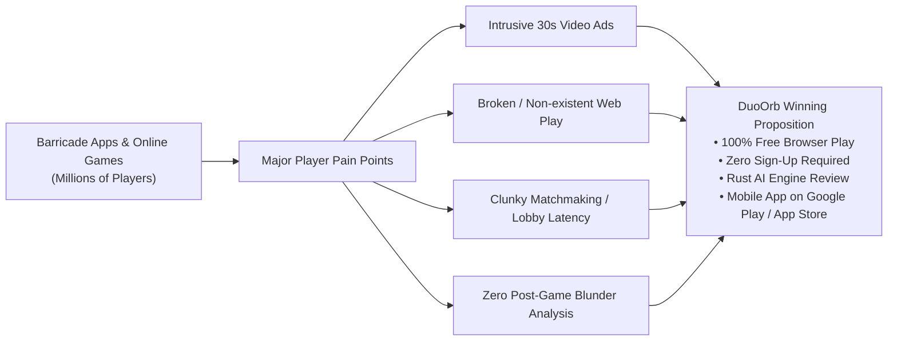

# DuoOrb: Web UI Design System & 2026 SEO Master Strategy

> **Unified Master Specification**: Complete UI Design System, Web-to-App Conversion Funnel, Competitor Teardowns, Viral Reverse-Search Architecture, and 2026 Generative Engine Optimization (GEO).  
> **Status**: Strategic Blueprint — Design First, Mobile App Presence & SEO Second.

---

# PART 1: UI & WEB DESIGN SYSTEM (DESIGN FIRST)

---

## 1.1 The Anti-"AI-Slop" Manifesto

Most web pages built in 2025–2026 suffer from identifiable design degeneration ("AI Slop"):
- **Generic Gradient Glow Blobs**: Purples and cyans haphazardly blurred across the background.
- **Vague Buzzword Typography**: Hollow, generic hero headlines with zero tactical game terminology.
- **Unusable Static Cards**: Floating 3-column cards with generic FontAwesome icons and no interactive feedback.
- **Zero Tangible Game Feel**: Visitors arriving for a tactile grid game see generic corporate SaaS templates.

### DuoOrb's Design Identity: Tactile Board Game Craftsmanship
DuoOrb's web interface is anchored in physical craftsmanship, high-contrast tactical readability, and board-first responsiveness:
1. **Board-First Screen Hierarchy**: The 9×9 grid, sphere orbs, grooved wall slots, and tactical HUD cards are the absolute heroes of the layout.
2. **Tactile Depth over Flat Minimalism**: Physical grooves, subtle inset shadows, clean matte fences, and glossy spherical player orbs.
3. **Instant Interactive Utility**: The user must touch, move, or preview gameplay within 500ms of landing—no static marketing fluff.
4. **Natural Web-to-App Conversion**: The website is the high-traffic web presence of the **DuoOrb Native Mobile App** (available on Google Play, coming soon to the Apple App Store). It converts casual searchers into app installs without annoying download-gate walls.

---

## 1.2 Color Palette & Semantic Token Architecture

The web palette directly mirrors DuoOrb's centralized design system in `DESIGN_SYSTEM.md` and `apps/mobile/src/theme.ts`.

### Single-Point Anchor: Electric Tactical Blue (`#2563EB`)
Updating this single base cascades into all elevated surfaces, focus rings, active tabs, and interactive states.

```css
:root {
  /* ========================================================
     1. BRAND & PRIMARY TOKENS (Player 1 / Primary Actions)
     ======================================================== */
  --primary: #2563EB;              /* Tactical Electric Blue (Default) */
  --primary-hover: #1D4ED8;        /* Darker Blue for Hover / Pressed */
  --primary-light: #DBEAFE;        /* Tinted badge / active pill container */
  --primary-glow: rgba(37, 99, 235, 0.28);

  /* ========================================================
     2. SECONDARY ACCENTS (Player 2 / Opponent / Alerts)
     ======================================================== */
  --secondary: #E5484D;            /* Tactical Crimson / Opponent Orb */
  --secondary-hover: #C53030;
  --secondary-light: #FEE2E2;      /* Crimson badge background */

  /* ========================================================
     3. TERTIARY / STATUS (Victory / Quick Match / Online)
     ======================================================== */
  --success: #16A34A;              /* Emerald Victory / Online Dot */
  --success-light: #E8F8EE;
  --warning: #F59E0B;              /* Golden Trophy / Rule Highlights */
  --warning-light: rgba(245, 158, 11, 0.12);

  /* ========================================================
     4. SURFACES & CANVAS (Tactile Light Theme - Default)
     ======================================================== */
  --bg-canvas: #FAF8FF;            /* Warm tactile canvas background */
  --surface-lowest: #FFFFFF;       /* Elevated cards, modals, game container */
  --surface-low: #F2F3FF;          /* Sub-cards, timer boxes, tray backdrops */
  --surface-mid: #EAEDFF;          /* Dividers, inactive pills, subtle borders */
  --surface-high: #E2E7FF;         /* Hover state on containers */

  /* ========================================================
     5. TEXT & HIGH-CONTRAST INVERSE
     ======================================================== */
  --text-primary: #131B2E;         /* Deep Slate / Headline contrast */
  --text-secondary: #434655;       /* Subtitles, stats, move annotations */
  --text-muted: #64748B;           /* Timers, breadcrumbs, copyright */
  --border-subtle: #E2E8F0;        /* Card and section outlines */
  --border-strong: #CBD5E1;        /* Focused inputs and active grooves */

  /* ========================================================
     6. BOARD SPECIFIC TOKENS
     ======================================================== */
  --board-wood-base: #E8E2D2;      /* Warm maple / birch tactile board base */
  --board-square: #FAF7F0;         /* Individual grid square surface */
  --board-groove: #C9BFAC;         /* Wall slot grooves between squares */
  --wall-placed: #8B4513;          /* Placed tactile wooden fence bar */
  --wall-ghost: rgba(37, 99, 235, 0.45); /* Wall placement preview ghost */
  --move-indicator: rgba(22, 163, 74, 0.35); /* Valid move target dot */

  /* ========================================================
     7. APP STORE BADGE & CONVERSION TOKENS
     ======================================================== */
  --store-badge-bg: #131B2E;       /* Deep slate for Google Play / App Store pills */
  --store-badge-border: rgba(255, 255, 255, 0.12);
  --store-badge-text: #FFFFFF;
  --store-badge-sub: #94A3B8;

  /* ========================================================
     8. ELEVATION SHADOWS
     ======================================================== */
  --shadow-sm: 0 1px 3px rgba(19, 27, 46, 0.05);
  --shadow-md: 0 4px 12px rgba(19, 27, 46, 0.07);
  --shadow-lg: 0 12px 32px rgba(19, 27, 46, 0.12);
  --shadow-orb-blue: 0 6px 14px rgba(37, 99, 235, 0.40);
  --shadow-orb-red: 0 6px 14px rgba(229, 72, 77, 0.40);
}
```

---

## 1.3 Typography System (`Manrope`)

- **Primary Font**: **Manrope** (Google Fonts loaded with `font-display: swap` and local fallback).
- **Tabular Figures**: Clocks, move counters, wall tallies, and ELO ratings must use `font-variant-numeric: tabular-nums` to eliminate layout jank.

### Type Scale Hierarchy

| Token | Size | Weight | Line Height | Tracking | Usage |
| :--- | :--- | :--- | :--- | :--- | :--- |
| `display-lg` | `44px` / `2.75rem` | 800 ExtraBold | `1.15` | `-0.03em` | Primary Hero Headline |
| `display-md` | `32px` / `2.00rem` | 800 ExtraBold | `1.20` | `-0.02em` | Section Titles (`<h2>`), Clock counters |
| `title-lg` | `24px` / `1.50rem` | 700 Bold | `1.30` | `-0.01em` | Card Headlines, Rule Titles |
| `title-md` | `18px` / `1.125rem`| 600 SemiBold | `1.40` | `0` | Sub-card headings, Player names |
| `body-lg` | `16px` / `1.00rem` | 400 Regular / 500 Medium | `1.65` | `0` | Main guide text, Rule explanations |
| `body-sm` | `14px` / `0.875rem`| 500 Medium | `1.50` | `0` | Microcopy, Table cells, FAQs |
| `badge-label`| `12px` / `0.75rem`| 700 Bold | `1.00` | `+0.05em` | Status chips, "8 Available", ELO chips |

---

## 1.4 Board & Visual Component Rules (SVG & Web)

### A. The Tactile Board Diagram Engine
Every diagram illustrating a rule, opening, or puzzle must be rendered using **lightweight inline SVG** (never static blurry PNGs or AI hallucinations).

```
┌─────────────────────────────────────────────────────────────┐
│  SVG BOARD SPECIFICATION (Standard 9×9 Grid)                 │
├─────────────────────────────────────────────────────────────┤
│  ViewBox:      0 0 450 450                                  │
│  Board Radius: rx="16" ry="16"                              │
│  Square Size:  40px × 40px (Gap: 8px between squares)       │
│  Wall Grooves: 8px wide channels between squares            │
│  Wall Bar:     Length 88px, Width 8px (Spans 2 squares)     │
│  Orb Spheres:  Radius 15px with Radial Gradient Highlight   │
│  Valid Move:   Radius 6px pulsing emerald circle            │
│  Move Arrow:   Dashed curved SVG arc with arrowhead         │
└─────────────────────────────────────────────────────────────┘
```

#### SVG Sphere Orb Gradients (3D Tactile Appearance)
```xml
<defs>
  <!-- Player 1 Blue Tactile Sphere -->
  <radialGradient id="p1Orb" cx="35%" cy="35%" r="65%">
    <stop offset="0%" stop-color="#93C5FD"/>
    <stop offset="40%" stop-color="#2563EB"/>
    <stop offset="100%" stop-color="#1E3A8A"/>
  </radialGradient>
  
  <!-- Player 2 Crimson Tactile Sphere -->
  <radialGradient id="p2Orb" cx="35%" cy="35%" r="65%">
    <stop offset="0%" stop-color="#FCA5A5"/>
    <stop offset="40%" stop-color="#E5484D"/>
    <stop offset="100%" stop-color="#7F1D1D"/>
  </radialGradient>
</defs>
```

### B. In-Game HUD & Wall Inventory Tray (Web Edition)
- **Opponent HUD**: Elevated white card (`--surface-lowest`) anchored with Opponent Name, ELO badge (`1500`), remaining wall count (`10/10`), and real-time clock counter (`03:00`).
- **Player HUD**: Mirror of Opponent HUD with active turn pulse dot (`--success`).
- **Wall Tray Controls**:
  - Horizontal Wall button with miniature preview icon.
  - Central Counter badge: `8 Walls Left` (in `--badge-label` bold tracking).
  - Vertical Wall button with miniature preview icon.
- **Drag & Tap States**: High-contrast hover/drag shadow with a semi-transparent "ghost wall" snapping to legal grid groove coordinates.

### C. Playable Hero Widget (The 500ms First-Impression Engine)
Right inside the hero fold of web landing pages:
1. Direct interactive mini-board (either full 9×9 or fast 5×5 demo).
2. Users can immediately click an adjacent legal square to move the Blue orb or tap a groove to drop a test wall.
3. Audio feedback (subtle wood "thud" on wall placement, tactile "pop" on orb step) via lightweight Web Audio API.

---

## 1.5 Web-to-App Conversion UI & Mobile Store Components

Because the website serves as the **official web presence for the mobile app (`com.asdigital.duoorb`)**, it must naturally guide web users to install the native app on Android and iOS:

### 1. Official Store Badges (Header, Hero & Footer)
- **Google Play Badge**: Direct link to `https://play.google.com/store/apps/details?id=com.asdigital.duoorb` with official Google Play SVG vector icon and "GET IT ON Google Play" typography.
- **Apple App Store Badge**: "Download on the App Store" / "Coming Soon to App Store (Pre-Order)" badge with Apple SVG icon.
- **Visual Style**: Sleek rounded pill (`border-radius: 10px`, background `--store-badge-bg`, border `1px solid var(--border-subtle)`), providing high-contrast trust.

### 2. Sticky Mobile Smart App Banner (`.smart-app-banner`)
On mobile browsers (iOS / Android viewport < 768px):
- Non-intrusive floating top or bottom bar.
- Elements: App Icon (512px Glossy DuoOrb icon), Title: **DuoOrb: Tactical Grid Game**, Subtitle: *4.9 ★ · Free on Google Play*, CTA Button: **INSTALL** (`--primary` pill).
- Dismissible `✕` button that remembers preferences via localStorage so it never annoys returning players.

### 3. Desktop "Scan to Play on Mobile" QR Card (`.qr-handoff-card`)
For desktop users visiting the website:
- High-resolution SVG QR code generated client-side pointing to the Universal Link / Play Store.
- Label: *"Take DuoOrb with you. Scan to install on your phone."*
- App store icons side-by-side below the QR code.

### 4. Post-Match App Conversion Sheet (`.post-match-app-sheet`)
When a visitor completes a game or solves a daily puzzle on the website:
- Toast/modal prompt:
  > **"Level up your game on the DuoOrb App"**  
  > *"Get haptic vibrations, offline bot practice, 120fps physics, and instant push notifications when friends challenge you."*  
  > `[Get on Google Play]` · `[App Store (Soon)]` · `[Keep Playing on Web]`

### 5. "Web vs Native App" Feature Strip
A clean, visual comparison chip showing why playing both web and mobile is great:

| Feature | DuoOrb Web (Instant) | DuoOrb Native App (Google Play & iOS) |
| :--- | :--- | :--- |
| **Friction** | **Instant in 1 click** (Zero download) | 1-Tap launch from home screen |
| **Offline Play** | Requires Internet | **Full offline bot matches without Wi-Fi/Data** |
| **Tactile Feel** | Mouse/touch clicks | **Haptic feedback vibrations on wall drops** |
| **Frame Rate** | 60 FPS Browser Canvas | **Ultra-smooth 120 FPS Native GPU rendering** |
| **Match Alerts** | Tab title flash | **Instant push notifications for friend moves** |

---

## 1.6 Anti-Slop UI Craftsmanship Rules (`antislop-ui` Standard)

To prevent generic AI templates from polluting DuoOrb's web pages, every layout, card, button, and interaction must adhere to the `antislop-ui` rules:

### 1. Visual & Color Rules
- **No Generic Blue-Purple / Blue-Cyan Gradients**: Gradients are forbidden as default full-page treatments or card backgrounds. Color is anchored strictly in `--primary: #2563EB`, `--secondary: #E5484D`, `--success: #16A34A`, and `--board-wood-base: #E8E2D2`. Gradients are reserved solely for functional spherical 3D orb depth.
- **Excessive Glassmorphism Dose Cap**: At most 1–2 elements per view (e.g. modal backdrop). Everything else sits on solid tactile surfaces (`--surface-lowest` / `--surface-low`).
- **No Uniform Pill Radii**: Buttons, inputs, and cards must not all share the same pill shape. Radii strictly follow the scale (`sm: 6px`, `md: 10px`, `lg: 16px`, `xl: 24px`), with full pills reserved for orbs, avatar chips, and CTAs.
- **Overly Soft Floating Shadows**: Most elements sit flat; only elevated drag states and active dialogs carry shadows.
- **Glow Dose Cap**: Glow is capped at at most 1–2 elements (e.g., active player turn pulse dot). Everything else remains matte.
- **No Background Grids / Blueprint Patterns**: Dot grids, graph paper, and blueprint lines are forbidden.
- **Tactile Light Canvas as Default**: `--bg-canvas: #FAF8FF` is the default. Dark mode is an intentional user toggle, not an ungrounded "tech" default.
- **Palette & Accent Discipline**: Active palette capped at 2–3 core tokens + 1 accent. Accent is reserved for key actions, not splashed across every line and icon.

### 2. Layout & Component Rules
- **No Monotonous Template Sequence**: Do not follow the predictable Hero $\rightarrow$ Feature Grid $\rightarrow$ Testimonial $\rightarrow$ FAQ sequence. Every page leads with an immediate playable board widget or real game HUD.
- **No Copy-Paste Feature Cards**: Vary card sizes and formats based on true content hierarchy. Flagship features (Rust Engine Review, 1-Tap Link Invites) get full-width interactive breakdowns.
- **No Default Bento Grids**: Use tiled mosaics only when content legitimately has differing physical sizes.
- **Vary Section Spacing & Rhythm**: Alternate between high-density board HUDs and spacious narrative explanations.
- **No "How It Works" Always 3 Steps**: Present rules truthfully according to the official rulebook.
- **No Fake "Trusted By" Logos**: Authentic leaderboards, verified match counts, and real player stats only.
- **Real Product Front and Center**: Never show a demo wearing a product's clothes. Show the real SVG 9×9 board, real algebraic coordinates (`e8`, `c3h`), and live Web Audio feedback.
- **No 4-Column Template Footers**: Link only to what genuinely exists: Play Online, Rules, Strategy, App Store/Google Play, and Terms.

### 3. Decorative Elements (Strictly Forbidden Defaults)
- **No Generic AI Icons**: Sparkles (`✨`), stars, magic wands, generic lightning bolts, and robot heads are forbidden. Use tactile board symbols (Orbs, Grooves, Fences, Clocks).
- **No Emoji as Decoration in UI Text**: Copy is completely free of decorative emoji (🚀, ✅, 🔥, 📈). Meaning is conveyed through crisp copy.
- **No Small Arrows on Every Button**: Reserve `→` or `↗` only for actions pointing to an external destination.
- **No Decorative Colored Left Stripes**: Colored card borders must mark real semantic state (Error, Golden Rule Warning), never pure decorative styling.
- **No AI Capsule Badges**: Pill badges are reserved for factual data: ELO rating (`1500 ELO`), Wall Count (`8 Left`), Clock (`03:00`).
- **No Eyebrow Badges Above the Headline**: No redundant pill badge sitting above the `<h1>` duplicating the title.
- **No Decorative Status Dots**: Every colored dot must mark a verified live state (e.g., opponent online; active turn).
- **No Fake Terminal Windows**: Never use code terminal windows with traffic light dots to display board game concepts.
- **No Disconnected 3D Blob Illustrations**: Use authentic SVG board diagrams, real mobile screenshots, or interactive game grids.

### 4. App & Dashboard Rules
- **Purpose-Built Screens**: Built around the player's immediate decision ("Find Match", "Review Blunder"), not an admin dashboard shell.
- **Real Stats & Placeholders**: No invented "+12% this week" metrics or "John Doe" fake leads. Empty states explain why they are empty and provide the single action to populate them.

### 5. Motion Rules
- **No Endless Pulses and Loops**: Perpetual motion is noise. Animations guide attention during user interaction (move animation, wall drop snap, game over banner entry) and then stop.
- **No Stacked Template Animations**: Avoid simultaneous Fade Up + Scale + Bounce on every card.

---

## 1.7 UI Skill Delivery Checklist (`antislop-ui` Gate)

Before delivering any web page, UI screen, or component in DuoOrb, verify that all 15 points pass:

- [ ] **1. Palette**: Derived strictly from `DESIGN_SYSTEM.md` (`PRIMARY_COLOR = #2563EB`), not the default gradient set.
- [ ] **2. Accent Discipline**: Accent color used at the key action moment only, not spread across every element.
- [ ] **3. No Decorative Emoji**: Copy is completely free of decorative emoji (🚀, ✅, 🔥) in headings, bullets, and buttons.
- [ ] **4. Layout Rhythm**: Section compositions visibly vary instead of repeating a uniform 3-card template.
- [ ] **5. No Default AI Shapes**: Free of bento-grid mosaic cliches, fake terminal windows, and decorative left-edge color stripes.
- [ ] **6. Clean Headline Space**: No redundant pill badge sitting above the `<h1>` duplicating the title.
- [ ] **7. Functional Controls**: Every navigation item and button has a real working destination or an explicit "Coming soon" state.
- [ ] **8. Purposeful Motion**: Motion triggers on user action with zero perpetual looping pulses.
- [ ] **9. Dose Caps Respected**: Glassmorphism, glow, and elevated shadows applied to at most 1–2 elements per view.
- [ ] **10. Truthful Status Dots**: Every colored dot marks a verified live state (e.g., online status, active turn); zero decorative dots.
- [ ] **11. Purpose-Built Hierarchy**: Screens are organized around the player's immediate decision, not a default dashboard shell.
- [ ] **12. Authentic Data**: All stats, timers, and ratings reflect actual game state or clean placeholders (no fake "+12% this week").
- [ ] **13. Real Form Placeholders**: Empty fields use descriptive labels (`Your Username`, `6-Digit Room Code`), not fake names (`John Doe`).
- [ ] **14. Actionable Empty States**: Empty and loading states state the reason and provide the one action to populate them.
- [ ] **15. Responsive & Accessible**: Layout renders cleanly at all breakpoints (mobile, tablet, desktop) and passes keyboard navigation.

---

# PART 2: SEO STRATEGY & PAGES (2026 ROADMAP)

---

## 2.1 2026 SEO Foundations: Generative Engine Optimization (GEO)

Traditional SEO (keyword stuffing, metadata keyword lists, repetitive paragraph blocks) is obsolete. Search engines and AI answering agents operate under **RAG (Retrieval-Augmented Generation)**:

```
┌─────────────────────────────────────────────────────────────┐
│                 HOW AI ENGINES CITE WEBSITES                │
├─────────────────────────────────────────────────────────────┤
│ 1. User prompts ChatGPT, Perplexity, or Google AI Overview  │
│ 2. Crawler retrieves top 5 semantic chunks via RAG          │
│ 3. Engine selects content that is:                          │
│    • Direct & Answer-First (no fluff or introductory filler)│
│    • Authoritative & Fact-dense (coordinates, notation, math│
│    • Supported by Structured JSON-LD Data                   │
│ 4. Engine generates response and embeds CITATION LINK       │
└─────────────────────────────────────────────────────────────┘
```

### The 4 Pillars of DuoOrb's 2026 SEO
1. **Answer-First Structure (AEO)**: Every question header is immediately followed by a 1–2 sentence unambiguous ruling.
2. **SXO (Search Experience Optimization)**: Embedding the playable interactive board right in the page hero drives dwell time above 2 minutes, signaling maximum relevance.
3. **Entity Knowledge Graph**: Connect DuoOrb to recognized board game history: *Mirko Marchesi (1997)*, *Philip Slater's Blockade (1975)*, and international naming variants (*Barricade*, *لعبة الحواجز*, *Wallz*).
4. **App Store & Web Synergy**: Linking the website entity to Google Play's `com.asdigital.duoorb` entity elevates both the website's SEO authority and the Play Store's ASO (App Store Optimization) ranking.

---

## 2.2 Competitor Strategy: BARRICADE (The Massive Online App Rival)

### Identifying the Real Competitor
"Barricade" in today's digital gaming market is **NOT an obscure 1959 dice game**—it is a **massive online mobile app and web game** (e.g., *Barricade: Strategy Board Game*, *Wallz: Barricade Wall Game*, *Blocade*, and browser ports) with **millions of active players worldwide**.



### Why Barricade App Players are Migrating:
1. **Ad Exhaustion**: Top Barricade apps force 30-second unskippable video ads after every single 2-minute round.
2. **App Store Lock-in**: Players cannot send a quick browser link to friends on PC or iPhone without forcing a 100MB app download.
3. **Lack of Deep Game Review**: None of the current Barricade games offer automated chess-style blunder/mistake/brilliant move classification.
4. **Visual Fatigue**: Dated, hyper-casual, or plastic textures.

### Target Keyword Matrix for Barricade Competitor Traffic:
- `"barricade game online"`
- `"barricade board game online free"`
- `"barricade strategy board game app alternative"`
- `"play barricade with friends browser"`
- `"barricade wall game no ads"`
- `"games like barricade on pc and android"`
- `"لعبة الباركاد اون لاين" / "لعبة الحواجز للكمبيوتر والجوال"`

---

## 2.3 The Viral Reels / TikTok Funnel ("Tip-of-the-Tongue" Reverse Search)

### The Anatomy of the Viral Video
Short-form creators on TikTok, Instagram Reels, and Facebook post overhead clips of 1v1 grid matches:
- Satisfying wooden clicks, dramatic wall traps, and diagonal leapfrogs.
- **The Creator Tactic**: They intentionally **omit the game name** from the video title and caption to generate comments (*"What is this game called?!"*).
- Millions of users flood Google and search engines using descriptive queries.

### The Two User Segments:
1. **Audience A (Named Searchers)**: Know the name or saw it in comments (`"Quoridor"`, `"Barricade game"`, `"Wallz"`).
2. **Audience B (Zero-Brand / Descriptive Searchers)**:
   - *"the game that have two balls"*
   - *"board game with two balls and walls"*
   - *"game where two balls place walls against each other"*
   - *"game seen on tiktok with wooden fences and two spheres"*
   - *"viral reel board game where you trap the other player"*
   - Arabic: *"لعبة فيها كرتين وجدار"* / *"لعبة الحواجز كرتين ضد بعض"*
   - French: *"jeu vu sur tiktok avec deux billes et des murs"*

### How DuoOrb Captures #1 Rank:
We deploy a dedicated reverse-lookup page: `what-is-the-game-with-two-balls-and-walls.html`.
- It directly confirms: *"The viral board game with two balls and walls you saw on TikTok is Quoridor / Barricade."*
- It recreates the exact viral setup in a playable interactive demo right below the text.
- Provides immediate 1-tap download buttons for Google Play & App Store to keep the game on their phone permanently.

---

## 2.4 The Web-to-App Acquisition Funnel (SEO + ASO Synergy)

Because DuoOrb exists on **Google Play (`com.asdigital.duoorb`) and soon on the Apple App Store**, every page functions as an acquisition funnel:

```
┌─────────────────────────────────────────────────────────────┐
│                 WEB-TO-APP CONVERSION FLOW                  │
├─────────────────────────────────────────────────────────────┤
│ 1. Organic Search / Viral Reels Query                       │
│    (User finds DuoOrb via Google, TikTok, or Reddit)        │
│                                                             │
│ 2. Immediate Web Play (Zero Friction)                       │
│    (User plays 1st match instantly in browser)              │
│                                                             │
│ 3. Conversion Trigger (Smart Banner / GameOver Sheet)       │
│    ("Want offline bots & haptics? Get the app")             │
│                                                             │
│ 4. Native App Installation                                  │
│    (Google Play / Apple App Store install)                  │
│                                                             │
│ 5. High Retention & Push Notifications                      │
│    (Long-term player retention on mobile device)            │
└─────────────────────────────────────────────────────────────┘
```

### Technical Web-to-App Setup:
1. **Smart App Banner for iOS**:
   ```html
   <meta name="apple-itunes-app" content="app-id=com.asdigital.duoorb, app-argument=https://duoorb.com/" />
   ```
2. **Android App Links (`.well-known/assetlinks.json`)**:
   Ensures that shared room links (`https://duoorb.com/?room=123456`) automatically open directly inside the installed native Android app.
3. **Structured Data with Direct Install URLs**:
   Google search parses the `installUrl` and displays an "Install" or "Get App" button directly in search engine result cards!

---

## 2.5 Information Architecture & Page Matrix

```
                          ┌───────────────────────────┐
                          │   duoorb.com / (Root)     │
                          │ Web App + App Store Hub   │
                          └─────────────┬─────────────┘
                                        │
     ┌──────────────────────────────────┼──────────────────────────────────┐
     │                                  │                                  │
┌────▼──────────────────────┐ ┌─────────▼──────────────────┐ ┌─────────────▼──────────────┐
│   quoridor-online.html    │ │        rules.html          │ │ what-is-the-game-with-      │
│ "Play Quoridor Free Hub"  │ │ "Illustrated Official      │ │ two-balls-and-walls.html    │
│ • Playable Mini-Board     │ │  Rulebook & Edge Cases"    │ │ [VIRAL REVERSE LOOKUP]      │
│ • Google Play CTA Pill    │ │ • 4 Custom SVG Diagrams    │ │ • Answers TikTok/Reels query│
│ • 1-Tap Room Generator    │ │ • Interactive Rule Checker │ │ • App Store Download CTAs  │
└────┬──────────────────────┘ └────────────────────────────┘ └─────────────────────────────┘
     │
     ├──────────────────────────────────┬──────────────────────────────────┐
     │                                  │                                  │
┌────▼──────────────────────┐ ┌─────────▼──────────────────┐ ┌─────────────▼──────────────┐
│ barricade-online-game     │ │  quoridor-strategy.html    │ │  quoridor-puzzles.html      │
│ [BARRICADE APP RIVAL]     │ │ "Openings, Wall Math &     │ │ "Daily Tactical Wall        │
│ • Compares Barricade Apps │ │  Endgame Theory (Master)"  │ │  Puzzle (Shareable)"        │
│ • Ad-Free App Download    │ │ • Reed & Shiller Openings  │ │ • Interactive Solver        │
└───────────────────────────┘ └────────────────────────────┘ └─────────────────────────────┘
```

### Detailed Breakdown of Each Page:

#### Page 1: `quoridor-online.html` (Primary Acquisition Hub)
- **Title**: `Play Quoridor Online Free — Modern Tactical Grid Board Game | DuoOrb`
- **Key Sections**:
  1. **Hero Fold**: Playable 9×9 mini-board + "Get on Google Play" & "Coming to App Store" badges.
  2. **1-Tap Private Room Generator**: Instant room code + shareable link.
  3. **Why Play DuoOrb**: Comparison matrix vs Board Game Arena and mobile app ports.
  4. **Multi-Level AI Personalities**: Blitzer, Defensive Staller, Deep Tactical Engine.
  5. **Reverse Lookup Notice**: *"Looking for the viral game with two balls and walls? Play it here!"*
  6. **App Store Feature Strip**: Why the native app offers offline bots, 120fps, and haptics.

#### Page 2: `rules.html` (Illustrated Rulebook & GEO Anchor)
- **Title**: `Official Quoridor & DuoOrb Rules Guide — Illustrated Movement & Walls`
- **Key Sections**:
  1. **Direct Answer Block**: 2-minute quick summary for Featured Snippets.
  2. **Interactive SVG Diagram 1**: Orthogonal pawn movement & groove wall placement.
  3. **Interactive SVG Diagram 2**: Straight leapfrog jump over opponent.
  4. **Interactive SVG Diagram 3**: The diagonal jump edge-case (wall behind opponent).
  5. **Interactive SVG Diagram 4**: The Golden Rule (illegal wall completely sealing exit).
  6. **4-Player Rules**: 5 walls per player, turn rotation, jump restrictions.
  7. **Download Mobile Rulebook / Offline App CTA**.

#### Page 3: `what-is-the-game-with-two-balls-and-walls.html` (Viral Reverse Lookup)
- **Title**: `What Is the Game with Two Balls and Walls? The Viral TikTok Board Game | DuoOrb`
- **Hero Answer (AEO Target)**:
  > **Direct Answer**: The viral game you saw on TikTok, Instagram Reels, or Facebook featuring **two balls (or pawns) racing across a wooden grid while placing walls to block each other** is **Quoridor** (also popular on mobile app stores as *Barricade* or *Wallz*). Invented by Mirko Marchesi in 1997, it is an award-winning abstract strategy game.  
  > You can play it completely free in your browser below, or download the **DuoOrb app on Google Play** to keep it permanently on your phone.
- **Viral Scenario Recreation**: Top-down SVG setup illustrating the iconic viral clip moment.
- **Embedded Playable Demo**: Direct interactive board allowing users to test the move immediately.
- **One-Tap App Install Buttons**: Prominent Google Play & App Store buttons.

#### Page 4: `barricade-online-game.html` (Capturing Barricade App Competitor Traffic)
- **Title**: `Play Barricade Online Free — The Ad-Free 1v1 Wall Strategy Game | DuoOrb`
- **Value Proposition**:
  - Direct alternative to ad-bloated mobile Barricade apps.
  - Zero-download web browser play on mobile, tablet, and PC.
  - Built-in post-game analysis engine powered by Rust.
  - **Native Mobile App**: Download on Google Play for smooth, ad-free play.
- **Feature Comparison Table**: DuoOrb Web vs *Barricade: Strategy Board Game* App vs *Wallz*.

#### Page 5: `quoridor-strategy.html` (Masterclass Openings & Math)
- **Title**: `Quoridor Strategy Guide — Openings, Path Counting Math & Wall Economy`
- **Topics**:
  - The Reed Opening (`c3h` + `f3h`).
  - The Shiller Opening (`e7v`).
  - Shortest Path Differential formula ($\Delta d$).
  - Endgame Wall Conservation Principle.

#### Page 6: `quoridor-puzzles.html` (Daily Tactical Challenge)
- **Title**: `Daily Tactical Grid Puzzle — Find the Winning Wall Placement | DuoOrb`
- **Features**:
  - One board state refreshed every 24 hours.
  - Interactive "Drop Wall" challenge.
  - Shareable score card for Discord, WhatsApp, and Reddit.
  - Post-solve CTA: *"Get daily push puzzles on the DuoOrb mobile app!"*

---

## 2.6 Schema.org Structured Data Architecture

Every page contains multi-graph JSON-LD structured data explicitly linking the web application to the native Android and iOS apps:

```json
{
  "@context": "https://schema.org",
  "@graph": [
    {
      "@type": "MobileApplication",
      "@id": "https://duoorb.com/#mobileapp",
      "name": "DuoOrb: Tactical Grid Board Game",
      "operatingSystem": "Android, iOS",
      "applicationCategory": "GameApplication",
      "genre": ["Abstract Strategy", "Board Game", "Tactical"],
      "offers": {
        "@type": "Offer",
        "price": "0",
        "priceCurrency": "USD"
      },
      "installUrl": "https://play.google.com/store/apps/details?id=com.asdigital.duoorb",
      "downloadUrl": "https://play.google.com/store/apps/details?id=com.asdigital.duoorb"
    },
    {
      "@type": "WebApplication",
      "@id": "https://duoorb.com/#webapp",
      "name": "DuoOrb Web",
      "url": "https://duoorb.com/",
      "applicationCategory": "GameApplication",
      "operatingSystem": "Web Browser",
      "browserRequirements": "Requires JavaScript. HTML5 Canvas & Web Audio supported."
    },
    {
      "@type": "HowTo",
      "name": "How to Play DuoOrb & Quoridor",
      "description": "Official illustrated rules for tactical grid board games.",
      "step": [
        {
          "@type": "HowToStep",
          "name": "Move Your Orb",
          "text": "Move one square forward, backward, left, or right on your turn."
        },
        {
          "@type": "HowToStep",
          "name": "Place a Tactical Wall",
          "text": "Place a wall spanning two squares into the board grooves to block your opponent."
        },
        {
          "@type": "HowToStep",
          "name": "Always Keep One Path Open",
          "text": "You can never completely seal off an opponent from reaching their goal line."
        }
      ]
    },
    {
      "@type": "FAQPage",
      "@id": "https://duoorb.com/#faq",
      "mainEntity": [
        {
          "@type": "Question",
          "name": "Where can I download the DuoOrb app?",
          "acceptedAnswer": {
            "@type": "Answer",
            "text": "DuoOrb is available for free on the Google Play Store for Android (com.asdigital.duoorb) and coming soon to the Apple App Store for iOS. You can also play immediately in any web browser at duoorb.com."
          }
        },
        {
          "@type": "Question",
          "name": "What is the viral game with two balls and walls seen on TikTok?",
          "acceptedAnswer": {
            "@type": "Answer",
            "text": "The viral board game with two balls and walls is Quoridor (also known as Barricade or Wallz on mobile). DuoOrb is the modern free online version playable in any web browser and available on Google Play."
          }
        }
      ]
    }
  ]
}
```

---

## 2.7 Implementation Phases

1. **Phase 1: Design System & Store Badges Asset Engine**:
   - Create inline SVG board templates for all 4 rule diagrams and hero boards.
   - Implement official Google Play and App Store SVG badge components + Desktop QR generator.
2. **Phase 2: Overhaul `rules.html`**:
   - Apply tactile CSS design system, Answer-First structure, interactive SVG diagrams, and "Download App for Offline Rules" hook.
3. **Phase 3: Overhaul `quoridor-online.html`**:
   - Integrate playable hero mini-board, 1-tap room creator, reverse-lookup highlight, and sticky smart app banner.
4. **Phase 4: Launch `what-is-the-game-with-two-balls-and-walls.html`**:
   - Capture viral zero-brand descriptive traffic from TikTok and Reels with direct download CTAs.
5. **Phase 5: Launch `barricade-online-game.html`**:
   - Capture competitor app migration traffic from Barricade mobile games, offering DuoOrb as the clean, ad-free mobile & web alternative.
6. **Phase 6: Launch Strategy & Puzzle Hubs**:
   - `quoridor-strategy.html` and `quoridor-puzzles.html` for high-authority link building and daily app re-engagement.

---
*Document saved to workspace root at `WEB_DESIGN_AND_SEO_STRATEGY.md`.*
